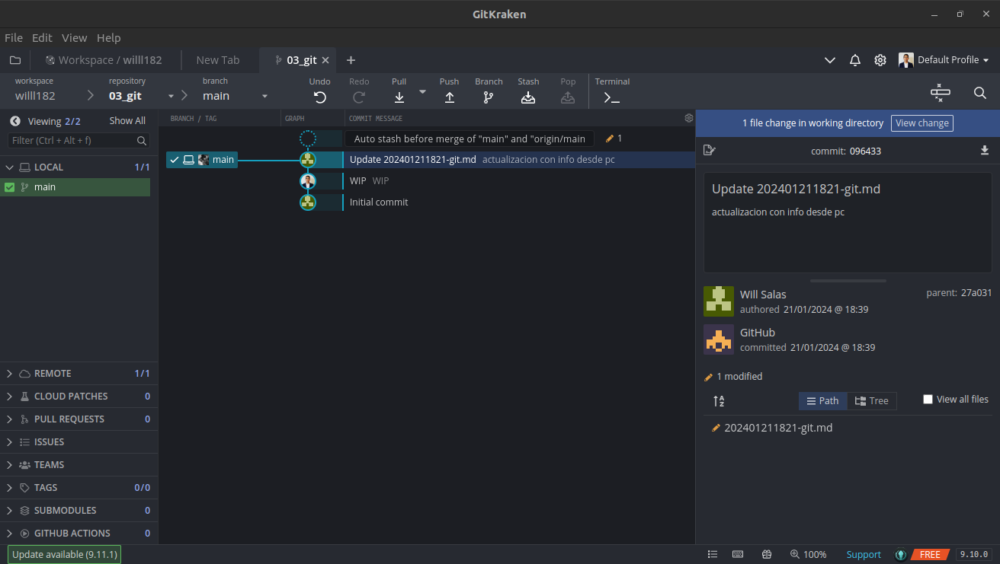

`---`
> Herramientas, guias, links y demás para git

`___`
# Git toolbox

## Objetivo

Happy Git provides opinionated instructions on how to:

* Install Git and get it working smoothly with GitHub, in the shell
* Develop a few key workflows that cover your most common tasks
* Integrate Git and GitHub into your daily work

The target reader is someone who uses R for data analysis or who works on R packages, although some of the content 

The first two parts, [Installation](https://happygitwithr.com/install-intro#install-intro) and [Connect Git, GitHub, RStudio](https://happygitwithr.com/connect-intro#connect-intro), provide a “batteries included” quick start to verify your setup.

In [Early GitHub Wins](https://happygitwithr.com/usage-intro#usage-intro), we rack up some early success with the basic workflows that are necessary to get your work onto GitHub. We also show the special synergy between R/R Markdown/RStudio and GitHub, which provides a powerful demonstration of why all this setup is worthwhile.

The use of Git/GitHub in data science has a slightly different vibe from that of pure software development, due to differences in the user’s context and objective. Happy Git aims to complement existing, general Git resources by highlighting the most rewarding usage patterns for data science. This perspective on the Git landscape is presented in [Basic Git Concepts](https://happygitwithr.com/git-intro#git-intro) and [Daily Workflows](https://happygitwithr.com/workflows-intro#workflows-intro).

## Motivacion

### GIT???

Sistema de control de versiones. Lleva control de la evolución de grupo de archivos (#repositorio) en una forma sana y altamente estructurada. Basicamente control de cambios.

No solo para codigo fuente

Para usuarios nuevo, vale la pena el esfuerzo, mas en un entorno que tiende al trabajo colaborativo.

### GitHub???

Servicio de almacenamiento. Mejor que Drive o Dropbox

Funciona como canal de distribución de los proyectos.

Seguro a prueba de errores debido al procedimiento de trabajo. Respaldo siempre a la mano. 
Github por mera comodidad.

### Va a costar???

**Si. Como un putas**

Toca instalar Git local, que el Git local hable con Github. El dolor de huevoas es solo una vez por PC.

1. Asignar Carpeta
2. Hacer un repositorio Git
3. Trabajo usual. Solo que ademas de #guardar_cambios en los archivos individuales, perodicamente se debe llevar a cabo #commit, el cual hace una captura de los archivos del proyecto
    * Han creado alguna vez una versión de un archivo agregando sus iniciales, la fecha o v1, v2, etc? Eso es hacer un #commit para un archivo. Es una versión significativa la cual puede ser util para revisar o para retornar
4. Periodicamente #push los #commit a Github. Es una señal que el trabajo está listo.

### Hay ventajas???

* Edit, save, attach. In this workflow, everyone has one (or more!) copies of the document and they circulate via email attachment. Which one is “master”? Is it even possible to say? How do different versions relate to each other? How should versions be reconciled? If you want to see the current best version, how do you get it? All of this usually gets sorted out by social contract and a fairly manual process.

* Google Doc. In this workflow, there is only one copy of the document and it lives in the cloud. Anyone can access the most recent version on demand. Anyone can edit or comment or propose a change and this is immediately available to everyone else. Anyone can see who’s been editing the document and, if disaster strikes, can revert to a previous version. A great deal of ambiguity and annoying reconciliation work has been designed away.

Managing a project via Git/GitHub is much more like the Google Doc scenario and enjoys many of the same advantages. It is definitely more complicated than collaborating on a Google Doc, but this puts you in the right mindset.
1.5 Who can do what?


# Configuracion herramientas
https://happygitwithr.com/github-acct#github-acct

## Crear cuenta Github

## Instalar Git

https://happygitwithr.com/install-git

Instalación en Ubuntu or Debian Linux:

```{Bash}
sudo apt-get install git
```

https://git-scm.com/download/linux

## Configurar Git

https://happygitwithr.com/hello-git

## Cliente Git

Girkraken
Cuenta Github

https://happygitwithr.com/git-client

https://happygitwithr.com/connect-intro

# Manos a la obra
## Repositorio

Casos de trabajo:

New project, GitHub first is the easiest way to get a working project.
Existing project, GitHub first is a deeply pragmatic way to get pre-existing work onto GitHub.
Existing project, GitHub last is the more proper way to connect existing local work to a remote on GitHub, especially if there’s already a Git history.

### Proyecto nuevo Github primero

Por qué? Al copiar desde Github se asegura uno que el repositorio local pueda hacer #pull y #push al acto. Clonar los proyectos

1. Hacer el repo en Github:
   - Go to https://github.com and make sure you are logged in.
2. Near “Repositories”, click the big green “New” button. Or, if you are on your own profile page, click on “Repositories”, then click the big green “New” button.
   - Configuracion: 
Repository template: No template.
Repository name: myrepo or whatever you wish to name your new project. Approach this similar to a variable name, in code: descriptive but brief, no whitespace. Letters, digits, -, ., or _ are allowed.
Description: “Analysis of the stuff” or any short description of the project. Write this for humans.
Public.
Initialize this repository with: Add a README file.
Click the big green button that says “Create repository”.

Flujo de trabajo


> [!TIP]
> Make a local change, commit, and push

3. Hacer cambios locales y guardar
4. Cargar los cambios al repositorio local
   - Hacerlo cuando el avance es importante. 
   - Notificacion de cambios
   
  - Ver cambios
  - Aceptar cambios #stage. Dejar comentario de cambios. 

5. #commit cambios en github

> [!TIP]
> Do this a few times a day, but possibly less often than you commit.

> [!TIP] Siempre primero un push antes de un pull
> You have new work in your local Git repository, but the changes are not online yet.

This will seem counterintuitive, but first let’s stop and pull from GitHub.

Why? Establish this habit for the future! If you make changes to the repo in the browser or from another machine or (one day) a collaborator has pushed, you will be happier if you pull those changes in before you attempt to push.

Click the blue “Pull” button in the “Git” tab in RStudio. I doubt anything will happen, i.e. you’ll get the message “Already up-to-date.” This is just to establish a habit.

Click the green “Push” button to send your local changes to GitHub. RStudio will report something along these lines:

>>> /usr/bin/git push origin HEAD:refs/heads/main
To https://github.com/jennybc/myrepo.git
   2899c91..b34cade  HEAD -> main
15.5 Confirm the local change propagated to the GitHub remote
Go back to the browser. I assume we’re still viewing your new GitHub repo.

Refresh.

You should see the new “This is a line from RStudio” in the README.

If you click on “commits,” you should see one with the message “Commit from RStudio”.

15.6 Make a change on GitHub
Click on README.md in the file listing on GitHub.

In the upper right corner, click on the pencil for “Edit this file”.

Add a line to this file, such as “Line added from GitHub.”

Edit the commit message in “Commit changes” or accept the default.

Click the big green button “Commit changes.”

15.6.1 GitLab
Click on README.md in the file listing on GitLab.

In the upper right corner, click on “Edit”.

Add a line to this file, such as “Line added from GitLab.”

Edit the commit message in “Commit changes” or accept the default.

Click the big green button “Commit changes.”

https://happygitwithr.com/git-intro

Git commands
A collection of some of the Git commands that have been largely going on under the hood. We’ve emphasized early workflows that are possible in RStudio. But all of this and much more can be done from the command line. This list is here mostly so we can consult it during live workshops if needed.

Unless you use the GitHub API, most of the GitHub bits really have to be done from the browser.

New local git repo from a repo on GitHub:

git clone https://github.com/jennybc/happy-git-with-r.git
Check the remote was cloned successfully:

git remote --verbose
Stage local changes, commit:

git add foo.txt
git commit --message "A commit message"
Check on the state of the Git world:

git status
git log
git log --oneline
Compare versions:

git diff
Add a remote to existing local repo:

git remote add origin https://github.com/jennybc/happy-git-with-r
git remote --verbose
git remote show origin
Push local main to GitHub main and have local main track main on GitHub:

git push --set-upstream origin main
# shorter form
git push -u origin main
# you only need to set upstream tracking once!
Regular push:

git push 
# the above usually implies (and certainly does in our tutorial)
git push origin main
# git push [remote-name] [branch-name]
Pull commits from GitHub:

git pull
Pull commits and don’t let it put you in a merge conflict pickle:

git pull --ff-only
Fetch commits

git fetch
Switch to a branch

git checkout [branch-name]
Checking remote and branch tracking

git remote -v
git remote show origin
git branch -vv

Repo, commit, diff, tag
20.1 Repos or repositories
Git is a version control system whose original purpose was to help groups of developers work collaboratively on big software projects. Git manages the evolution of a set of files – called a repository or repo – in a highly structured way. Historically, these files would have consisted of source code and the instructions for how to build an application from its source.

Git has been re-purposed by the data science community (Ram 2013; Bartlett 2016; Perez-Riverol et al. 2016). We use it to manage the motley collection of files that make up typical data analytical projects, which consist of data, figures, reports, and, yes, some source code.

For new or existing projects, we recommend that you:

Dedicate a local directory or folder to it.
Make it an RStudio Project. Optional but recommended; obviously only applies to projects involving R and users of RStudio.
Make it a Git repository.
This setup happens once per project and can happen at project inception or at any later point. Chances are your existing projects each already live in a dedicated directory. Making such a directory an RStudio Project and Git repository boils down to allowing those applications to leave notes for themselves in hidden files or directories. The project is still a regular directory on your computer, that you can locate, name, move, and generally interact with as you wish. You don’t have to handle it with special gloves!

The daily workflow is probably not dramatically different from what you do currently. You work in the usual way, writing R scripts or authoring reports in LaTeX or R Markdown. But instead of only saving individual files, periodically you make a commit, which takes a snapshot of all the files in the entire project. If you have ever versioned a file by adding your initials or the date, you have effectively made a commit, albeit only for a single file. It is a version that is significant to you and that you might want to inspect or revert to later. Periodically, you push commits to GitHub. This is like sharing a document with colleagues on DropBox or sending it out as an email attachment. By pushing to GitHub, you make your work and all your accumulated progress accessible to others.

This is a moderate change to your normal, daily workflow. It feels weird at first, but quickly becomes second nature. In STAT 545 students are required to submit all coursework via GitHub, starting in week one. Most have never seen Git before and do not identify as programmers. It is a major topic in class and office hours for the first two weeks. Then we practically never discuss it again.

20.2 Commits, diffs, and tags
We now connect the fundamental concepts of Git to the data science workflow:

repository
commit
diff
Recall that a repository or repo is just a directory of files that Git manages holistically. A commit functions like a snapshot of all the files in the repo, at a specific moment. Under the hood, that is not exactly how Git implements things. Although mental models don’t have to be accurate in order to be useful, in this case it helps to align the two.

\label{fig:commit-diff-sha-tag}Partial commit history for our iris example, highlighting diffs, commit messages, SHAs, and tags.
Figure 20.1: Partial commit history for our iris example, highlighting diffs, commit messages, SHAs, and tags.

Figure 20.1 is a look at a fictional analysis of the iris data, focusing on the evolution of a script, iris.R. Consider version A of this file and a modified version, version B. Assume that version A was part of one Git commit and version B was part of the next commit. The set of differences between A and B is called a “diff” and Git users contemplate diffs a lot. Diff inspection is how you re-explain to yourself how version A differs from version B. Diff inspection is not limited to adjacent commits. You can inspect the diffs between any two commits.

In fact, Git’s notion of any specific version of iris.R is as an accumulation of diffs. If you go back far enough, you find the commit where the file was created in the first place. Every later version is stored by Git as that initial version, plus all the intervening diffs in the history that affect the file. We’ll set these internal details aside now, but understanding the importance of these deltas will make Git’s operations less baffling in the long run.

So, by looking at diffs, it’s easy to see how two snapshots differ, but what about the why?

Every time you make a commit you must also write a short commit message. Ideally, this conveys the motivation for the change. Remember, the diff will show the content. When you revisit a project after a break or need to digest recent changes made by a colleague, looking at the history, by reading commit messages and skimming through diffs, is an extremely efficient way to get up to speed. Figure 20.1 shows the messages associated with the last three commits.

Every commit needs some sort of nickname, so you can identify it. Git does this automatically, assigning each commit what is called a SHA, a seemingly random string of 40 letters and numbers (it is not, in fact, random but is a SHA-1 checksum hash of the commit). Though you will be exposed to these, you don’t have to handle them directly very often and, when you do, usually the first 7 characters suffice. The commit messages in Figure 20.1 are prefixed by such truncated SHAs. You can also designate certain snapshots as special with a tag, which is a name of your choosing. In a software project, it is typical to tag a release with its version, e.g., “v1.0.3”. For a manuscript or analytical project, you might tag the version submitted to a journal or transmitted to external collaborators. Figure 20.1 shows a tag, “draft-01”, associated with the last commit.


Branches
Branching means that you take a detour from the main stream of development and do work without changing the main stream. It allows one or many people to work in parallel without overwriting each other’s work. It allows a someone working solo to work incrementally on an experimental idea, without jeopardizing the state of the main product.

Branching in Git is very lightweight, which means creating a branch and switching between branches is nearly instantaneous. This means Git encourages workflows which create small branches for exploration or new features, often merging them back together quickly.

22.1 Create a new branch
You can create a new branch with git branch, then checkout the branch with git checkout. To distinguish it from the main stream of development, presumably on main, we’ll call this a “feature branch”.

git branch issue-5
git checkout issue-5
You can also use the shortcut git checkout -b issue-5 to create and checkout the branch all at once.

Once you have switched to a branch, you can commit to it as usual.

22.2 Switching branches
You use git checkout to switch between branches.

But what do you do if you are working on a branch and need to switch, but the work on the current branch is not complete? One option is the Git stash, but generally a better option is to safeguard the current state with a temporary commit. Here I use “WIP” as the commit message to indicate work in progress.

git commit --all -m "WIP"
git checkout main
Then when you come back to the branch and continue your work, you need to undo the temporary commit by resetting your state. Specifically, we want a mixed reset. This is “working directory safe”, i.e. it does not affect the state of any files. But it does peel off the temporary WIP commit. Below, the reference HEAD^ says to roll the commit state back to the parent of the current commit (HEAD).

git checkout issue-5
git reset HEAD^
If this is difficult to remember, or to roll the commit state back to a different previous state, the reference can also be given as the SHA of a specific commit, which you can see via git log. This is where I think a graphical Git client can be invaluable, as you can generally right click on the target commit, then select the desired type of reset (e.g., soft, mixed, or hard). This is exactly the type of intermediate-to-advanced Git usage that often feels more approachable in a graphical client.

22.3 Merging a branch
Once you have done your work and committed it to the feature branch, you can switch back to main and merge the feature branch.

git checkout main
git merge issue-5
22.4 Dealing with conflicts
Most of the time, the merge will go smoothly. However if both the branches you are merging changed the same part of the same file you will get a merge conflict.

git merge issue-5
# Auto-merging index.html
# CONFLICT (content): Merge conflict in index.html
# Automatic merge failed; fix conflicts and then commit the result.
The first thing to do is NOT PANIC. Merge conflicts are not the end of the world and most are relatively small and straightforward to resolve.

The first step to solving a merge conflict is determining which files are in conflict, which you can do with git status:

git status
# On branch main
# You have unmerged paths.
#   (fix conflicts and run "git commit")
# 
# Unmerged paths:
#   (use "git add <file>..." to mark resolution)
# 
#     both modified:      index.html
# 
# no changes added to commit (use "git add" and/or "git commit -a")
So this shows only index.html is unmerged and needs to be resolved. We can then open the file to see what lines are in conflict.

<<<<<<< HEAD:index.html
<div id="footer">contact : email.support@github.com</div>
=======
<div id="footer">
 please contact us at support@github.com
</div>
>>>>>>> issue-5:index.html
In this conflict, the lines between <<<<<< HEAD:index.html and ====== are the content from the branch you are currently on. The lines between ======= and >>>>>>> issue-5:index.html are from the feature branch we are merging.

To resolve the conflict, edit this section until it reflects the state you want in the merged result. Pick one version or the other or create a hybrid. Also remove the conflict markers <<<<<<, ====== and >>>>>>.

<div id="footer">
please contact us at email.support@github.com
</div>
Now run git add index.html and git commit to finalize the merge. CONFLICTS RESOLVED.

22.4.1 Bailing out
If, during the merge, you get confused about the state of things or make a mistake, use git merge --abort to abort the merge and go back to the state prior to running git merge. Then you can try to complete the merge again.

Git Basic Branching and Merging:

https://git-scm.com/book/en/v2/Git-Branching-Basic-Branching-and-Merging

## Cheatsheets